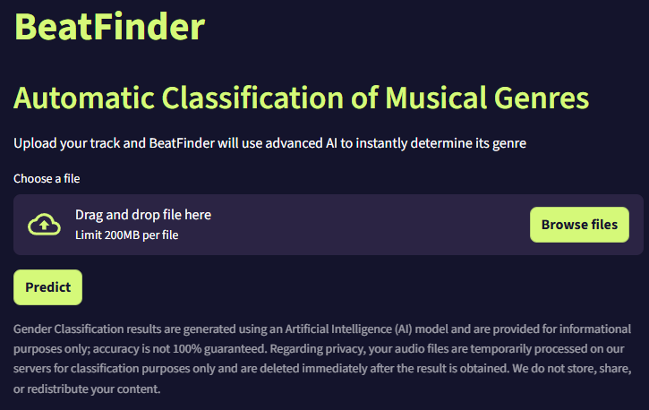

[Español](README-es.md) | [English](README.md)

# BeatFinder 🎧: Clasificación de Géneros Musicales con Redes Neuronales

**BeatFinder** es el proyecto final del Bootcamp de Data Science & Machine Learning en 4Geeks Academy. Su objetivo principal es clasificar automáticamente grabaciones de audio en uno de sus 16 géneros principales utilizando las características acústicas de la señal y un modelo de Red Neuronal Profunda (DNN).

## 📄 Índice

- [¿Cómo Usarlo?](#-cómo-usarlo) 🚀
- [Objetivo del Proyecto](#-objetivo-del-proyecto) 🎯
- [Tecnología y Herramientas](#-tecnología-y-herramientas) 🧠
- [Exploración y Preprocesamiento de Datos (EDA)](#-exploración-y-preprocesamiento-de-datos-eda) 📊
- [Resultados del Modelo](#-resultados-del-modelo) 🏆
- [Estructura del Repositorio](#-estructura-del-repositorio) ⚙️
- [Próximas Ideas y Expansión del Proyecto](#-próximas-ideas-y-expansión-del-proyecto) 🚀
- [Co-creadores](#-co-creadores) 🧑‍💻

---

## 🚀 ¿Cómo Usarlo?



La aplicación BeatFinder está desplegada usando Streamlit. Para ejecutarla localmente y utilizar el modelo de clasificación, sigue estos pasos:

1.  **Navega al Directorio Fuente:**
    Abre tu terminal o símbolo del sistema y cambia el directorio a la carpeta `src`, donde se encuentra el archivo principal de la aplicación (`app.py`).

    ```bash
    cd src
    ```

2.  **Ejecuta la Aplicación Streamlit:**
    Ejecuta la aplicación utilizando la interfaz de línea de comandos de Streamlit.

    ```bash
    python -m streamlit run app.py
    ```

3.  **Accede a la Aplicación:**
    Se abrirá automáticamente una nueva pestaña en tu navegador web, dirigiéndote a la aplicación en ejecución o haz `Ctrl+click` para abrirla (normalmente en `http://localhost:8501`).

4.  **Carga y Clasifica:**
    Dentro de la aplicación, sube un archivo de audio y haz clic en el botón **"Predict"** para iniciar la clasificación del género.


## 🎯 Objetivo del Proyecto

El objetivo principal de este proyecto es desarrollar un modelo de clasificación capaz de identificar el género musical de una pista basándose únicamente en sus propiedades acústicas.

La capacidad de realizar esta tarea de forma automática resulta valiosa en
contextos como:

1. La **optimización** de sistemas de recomendación musical,
2. La **organización** eficiente de grandes bibliotecas digitales,
3. El **análisis** de tendencias en la industria musical.

Para esto hemos realizado lo siguiente:

- **Extracción de Características (Feature Extraction)**: Utilizando Librosa, transformamos las señales de audio (representadas por el dataset [FMA](https://www.kaggle.com/datasets/imsparsh/fma-free-music-archive-small-medium) en características numéricas clave (MFCCs, Centroide Espectral, Tonalidad, etc.).

- **Preprocesamiento y Exploración (EDA)**: Limpiamos, analizamos y estandarizamos los datos, comparando el impacto de la detección y acotamiento de outliers.

- **Modelado**: Diseñamos y optimizamos una Red Neuronal Densa (DNN) para maximizar la precisión en la identificación de géneros tras explorar otros modelos así como Random Forest, SVM o Regresión Logísitca.

_Finalmente el modelo tiene 49,133 filas y 519 variables pudiendo predecir hasta 16 géneros distintos._

## 🧠 Tecnología y Herramientas

| Categoría             | Herramientas Clave                                                                                                                 |
| :-------------------- | :--------------------------------------------------------------------------------------------------------------------------------- |
| **Modelado & ML**     | **TensorFlow/Keras** (Redes Neuronales), **Scikit-learn** (Random Forest, SVM), **Keras Tuner** (Optimización de Hiperparámetros). |
| **Análisis de Audio** | **Librosa** (Extracción de MFCCs, ZCR, Tonnetz, etc.)                                                                              |
| **Lenguaje**          | **Python, Streamlit**                                                                                                              |
| **Gestión de Datos**  | **Pandas, NumPy**                                                                                                                  |
| **Visualización**     | **Seaborn, Matplotlib**                                                                                                            |
| **Ingeniería de ML**  | Guardado de **scalers** (`.pkl`) y **modelos**.                                                                                    |

## 📊 Exploración y Preprocesamiento de Datos (EDA)

El proyecto se basó en el dataset FMA (Free Music Archive), que contiene metadatos y características pre-extraídas.

Desafíos Superados:

- **Limpieza de Columnas**: Se manejó la compleja jerarquía de tres niveles en las columnas de características y se convirtió la información de género de strings a listas.

- **Selección del Dataset Ganador**: Se evaluaron 6 combinaciones de datos (Con/Sin Outliers, Crudos/Normalizados/MinMax) para determinar cuál ofrecía la mejor Accuracy inicial, encontrando que [Menciona el dataset ganador aquí, ej: X_train_sin_outliers_norm] fue el más efectivo para la clasificación.

- **Gestión del Desequilibrio**: El análisis univariante reveló un marcado desequilibrio de clases (predominio de Electronic, Rock, Experimental), un factor crítico a considerar en la evaluación del rendimiento. Por ello y por falta de datos decidimos mantener los géneros musicales más representativos.

- **Gestión de la RAM**: Para realizar nuestro trabajo nos hemos valido de Google Colab y GitHub Codespaces y pronto nos quedamos sin RAM debido a la gran cantidad de datos que el ordenador debía procesar. Para ello ajustamos los datatypes y eliminamos todas aquellas variables que dejamos de usar.

## 🏆 Resultados del Modelo

Se compararon cuatro modelos principales. El mejor rendimiento se logró tras la optimización de hiperparámetros de la Red Neuronal mediante Keras Tuner utilizando el mejor dataset seleccionado.

| Modelo                 | Optimización                | Accuracy |
| :--------------------- | :-------------------------- | :------- |
| **Red Neuronal (DNN)** | Keras Tuner                 | 69%      |
| Random Forest          | RandomizedSearchCV          | 55'34%   |
| SVM (RBF/Lineal)       | RandomizedSearchCV (Subset) | 62'65%   |
| Regresión Logística    | Base                        | 56'56%   |

🥇 El modelo ganador fue la Red Neuronal con una precisión final superior al 69%.

## ⚙️ Estructura del Repositorio

```
├── music_genre_identifier/
│   ├── data/
│   │   ├── processed/ (Contiene .parquet de X_train/test normalizados/minmaxed)
│   └── src/
│       ├── factorized_data/ (Contiene factorized_genre_top.json para decodificación)
│       └── models/ (Contiene el scaler y los modelos .pkl para despliegue en Streamlit)
├── models/
│   └── neural_network.pkl (El objeto del modelo ganador final)
└── README.md
```

## 🚀 Próximas Ideas y Expansión del Proyecto

### 1. Ideas de Producto y UX/UI (Lado Izquierdo)

Estas ideas se centran en cómo el usuario final interactuaría con el producto y cómo se generaría valor.

- **Ingresar una estrofa y obtener automáticamente información detallada de la canción**: Esto implica un motor de búsqueda de audio avanzado (similar a Shazam o SoundHound), que requeriría un modelo de Machine Learning para la búsqueda por hashing de audio.

- **Integrar un sistema de recomendación**: Utilizar el modelo de clasificación de géneros y las características extraídas para recomendar canciones similares, lo que requiere un modelo de recomendación adicional (basado en contenido o filtrado colaborativo).

- **Visualización del audio y la playlist recomendada**: Podrías escuchar una preview de la canción seleccionada tanto la que subes como las de la playlist.

- **Monetizar**: Un banner con publicidad o incluso una suscripción de pago para evitar estos anuncios.

### 2. Ideas de Desarrollo Técnico y ML (Lado Derecho)

Estas ideas son mejoras directas para la base de datos y el modelo de Machine Learning.

- **Explorar técnicas avanzadas de manejo de desbalance de clases**: Esto mejoraría la precisión del modelo así como poder identificar más géneros de música que ahora mismo no están disponibles.

- **Realizar ingeniería de características más profunda o selección de características más sofisticada**: así como BPM, segmentación, etc.

- **Integración con APIs externas (Spotify, Apple Music, YouTube Music)**: Es la implementación práctica de la preview de la canción que mencionamos anteriormente.

Aquí un mockup de cómo podría verse la aplicación web:


## 🧑‍💻 Co-creadores

Este proyecto fue desarrollado en colaboración por:

[Daniel Páez](https://github.com/danielpaez-dev) | [Ivan Díaz](https://github.com/ivandla96) | [Tulio Giménez](https://github.com/TulioGimenez)
